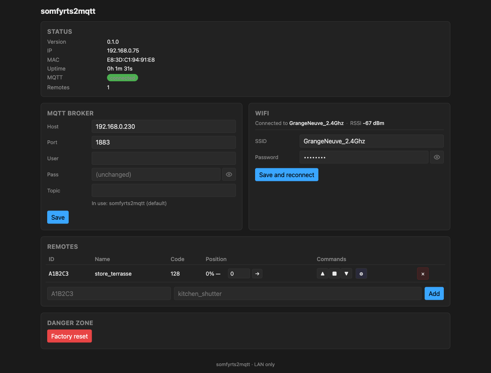

# somfyrts2mqtt

A Somfy RTS to MQTT bridge running on an ESP32 + CC1101 transceiver. Plug it on your LAN, configure it once via a captive portal, and your Somfy RTS shutters and awnings become controllable from any MQTT-aware home automation system.

The MQTT layer follows the [Tasmota Shutter convention](https://tasmota.github.io/docs/Blinds-and-Shutters/) — `cmnd/<root>/<name>/{Open,Close,Stop,Position,…}` topics, `tele/<root>/SENSOR` aggregated telemetry, `tele/<root>/LWT` retained presence. Any client that already speaks Tasmota integrates out of the box :

- **[Sowel](https://docs.sowel.org)** via the [`sowel-plugin-somfy-rts`](https://github.com/mchacher/sowel-plugin-somfy-rts) plugin — the original target ; this bridge is a companion device for the Sowel home-automation engine
- **[Home Assistant](https://www.home-assistant.io/integrations/mqtt/)** via the MQTT Cover integration (see the sample YAML in [docs/mqtt-api.md](docs/mqtt-api.md#home-assistant))
- **OpenHAB**, **Node-RED**, **mosquitto_pub**, or any custom MQTT client

The bridge stays a "dumb" RF transponder à la Zigbee2MQTT : every home-automation rule lives upstream.


The reference hardware is an ESP32-C3 Super Mini + CC1101 module wired together in a 3D-printed housing (FreeCAD source + STLs in [`meca/`](meca/)). Total cost ~10 €. The 7-wire ESP32 ↔ CC1101 interconnect can be done with regular soldering or with **30 AWG wire-wrap** — we strongly prefer wire-wrap for this kind of compact, point-to-point job : tighter, lower impedance, no rosin mess, and the connection looks far cleaner inside the housing. See [`meca/README.md`](meca/README.md#interconnect--wire-wrapping-recommended) for the why and the tool list, and [docs/hardware.md](docs/hardware.md) for the BoM and the pinout. If you would rather not solder anything, the firmware also supports the off-the-shelf **ESP32-S3 PICYBI Radio Remote** board (CC1101 already wired) — flash its `esp32-s3-picybi` binary instead.



## Features

- **Tasmota-style MQTT API** (Shutter subset) — `cmnd / stat / tele` topics, LWT, retained presence. Drop-in for any client that speaks Tasmota.
- **Time-based shutter position** (0-100 %) — calibrate Open / Close durations once, then send `Position 50` to move mid-travel.
- **Awning support** — per-remote Invert flag swaps Up / Down so a "store banne" reads as "100 % = extended".
- **WiFi captive portal commissioning** — fresh boot opens an AP, phone joins, enter SSID + password. No serial console required.
- **4-power-cycle AP recovery** — lost the LAN, wrong password, moved router ? Cycle the power 4 times within 5 s each → forces AP mode for re-commissioning.
- **mDNS** — reach the bridge as `somfyrts2mqtt.local`, no DHCP lease hunting.
- **Web admin UI** — embedded single-page, no external host. Configure broker, WiFi, durations, pair / erase remotes.
- **OTA updates** — one pre-built `firmware.bin` **per board** published with each tagged release on GitHub. The user uploads the one matching their board from the admin UI's *Update firmware* section ; the bridge validates the image, writes the second OTA slot, and reboots. A binary built for the wrong chip is rejected up front with a clear message, and a botched write is rolled back automatically by the dual-app partition scheme.

## Quickstart

### 1. Wire the CC1101

See [docs/hardware.md](docs/hardware.md) for the bill of materials, pinout, antenna, and power notes.

### 2. Flash the firmware

For the **first flash** (no firmware on the board yet), grab the pre-built `firmware.bin` **matching your board** from [the latest GitHub Release](https://github.com/mchacher/somfyrts2mqtt/releases/latest) — `…-esp32-c3-mini.bin` for the C3 Super Mini, `…-esp32-s3-picybi.bin` for the PICYBI ESP32-S3 — and upload it via `esptool`, or build from source :

```bash
git clone https://github.com/mchacher/somfyrts2mqtt.git
cd somfyrts2mqtt

# Build + upload (USB cable plugged in). Pick the env matching your board:
pio run -e esp32-c3-mini   -t upload -t monitor   # ESP32-C3 Super Mini
pio run -e esp32-s3-picybi -t upload -t monitor   # ESP32-S3 (PICYBI Radio Remote)
```

No code-side credentials needed — the firmware boots into a captive portal on first start.

Subsequent updates can be done **over WiFi without a USB cable** : download the new `.bin` from Releases, drop it in the admin UI's *Update firmware* section. See [docs/setup.md](docs/setup.md#updating-firmware-over-the-air).

### 3. Configure on first boot

The bridge advertises an open WiFi SSID `somfyrts2mqtt-<MAC>`. Connect with your phone, open `http://192.168.4.1`, enter your home WiFi credentials. The bridge reboots and joins your LAN.

See [docs/setup.md](docs/setup.md) for the full walkthrough.

### 4. Use the web UI

Open `http://somfyrts2mqtt.local/` (or the LAN IP shown in the Status block on the previous step). Configure your MQTT broker, add a Somfy remote (ID + name), calibrate Open / Close durations, and you are done.

See [docs/web-ui.md](docs/web-ui.md) for a section-by-section tour.

### 5. Talk MQTT

```bash
# Move kitchen blind fully open (100 %)
mosquitto_pub -h <broker> -t cmnd/somfyrts2mqtt/kitchen/Open -m ""

# Move halfway
mosquitto_pub -h <broker> -t cmnd/somfyrts2mqtt/kitchen/Position -m 50

# Tail telemetry
mosquitto_sub -h <broker> -t "tele/somfyrts2mqtt/#" -v
```

The Tasmota Shutter command set is documented in [docs/mqtt-api.md](docs/mqtt-api.md). A user-friendly Python CLI is shipped in [tools/mqtt-cli.py](tools/mqtt-cli.py).

## Documentation

| Page | Content |
|---|---|
| [docs/hardware.md](docs/hardware.md) | Bill of materials, ESP32 ↔ CC1101 wiring, antenna, power supply notes |
| [docs/setup.md](docs/setup.md) | Build, first flash, captive portal commissioning, factory reset, 4-power-cycle recovery |
| [docs/web-ui.md](docs/web-ui.md) | Section-by-section walkthrough with screenshots |
| [docs/mqtt-api.md](docs/mqtt-api.md) | Tasmota Shutter topic reference, payload examples, LWT, mqtt-cli.py |
| [docs/troubleshooting.md](docs/troubleshooting.md) | Common pitfalls (AUTH_EXPIRE on C3, dead CC1101, mDNS resolution, etc.) |
| [docs/releasing.md](docs/releasing.md) | Maintainer-side : how to cut a release, versioning, PR labels for the auto-generated notes |
| [CLAUDE.md](CLAUDE.md) | Project conventions, code style, contribution notes |
| [specs/](specs/) | Per-iteration design notes (specs / architecture / plan) |

## Project layout

```
somfyrts2mqtt/
├── src/, include/         Firmware source (Arduino-ESP32, C++17)
├── lib/                   Vendored libraries (none currently, libs via PlatformIO)
├── test/                  Native (host) unit tests (Unity)
├── tools/                 Helper scripts (mqtt-cli.py, requirements.txt)
├── specs/                 Per-iteration design notes
├── docs/                  This documentation
└── .github/workflows/     CI : build + cppcheck + native tests + CodeQL + Dependabot
```

## Status

Active development. Validated on the ESP32-C3 Super Mini (reference DIY build) and the ESP32-S3 PICYBI Radio Remote (off-the-shelf, CC1101 pre-wired). Each ships its own release binary; see spec `021-multiboard-ota-safety`. Spec roadmap : [specs/](specs/).

## License

**GNU GPL v3.0** — see [LICENSE](LICENSE). Aligns with Tasmota (whose Shutter MQTT protocol this bridge speaks), keeps every downstream fork open-source.

Third-party libraries shipped at runtime are listed in [THIRD_PARTY_LICENSES.md](THIRD_PARTY_LICENSES.md) with their respective licenses (mostly MIT, a few LGPL-3.0 and Apache 2.0). All are GPL-3.0 compatible.
