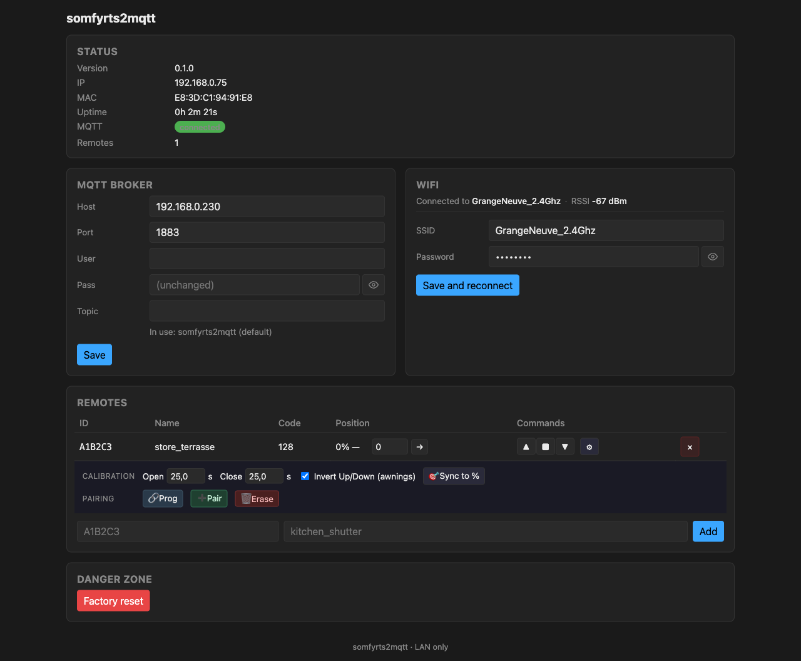

# Web UI walkthrough

The bridge embeds a single-page admin UI on port 80, no external dependencies. Open `http://somfyrts2mqtt.local/` (preferred) or the LAN IP shown in your router.

The page has four cards : **Status**, **MQTT broker**, **WiFi**, **Remotes**, plus a **Danger zone** row at the bottom.

## Status

Read-only summary of the bridge.

| Field | Meaning |
|---|---|
| Version | Firmware version baked at build time |
| IP | DHCP-assigned LAN address. Useful when mDNS does not resolve (some Linux / Android stacks) |
| MAC | Chip MAC. Last 6 hex are reused as the AP SSID suffix for commissioning |
| Uptime | Time since last boot |
| MQTT | Pill, green when connected to the broker, red otherwise |
| Remotes | Count of registered virtual remotes |

The Status card refreshes every 5 seconds.

## MQTT broker

Editable form. Same fields as any Tasmota / ESPHome config :

| Field | Notes |
|---|---|
| **Host** | Broker hostname or IP. No `mqtt://` prefix |
| **Port** | TCP port. 1883 for plain, 8883 for TLS (TLS not yet supported) |
| **User** / **Pass** | Optional. Empty Pass means "keep current" — leave empty when changing User but keeping the password |
| **Topic** | Tasmota-style root topic. Empty = default `somfyrts2mqtt`. Set distinct values if you run multiple bridges on the same broker |

The `In use:` line below the Topic field shows the active root the bridge currently publishes / subscribes against. Useful when the Topic was left empty — confirms which default was picked.

Click **Save** to persist. The bridge reconnects with the new settings ; the Status pill should flip back to green within a few seconds.

## WiFi

Editable WiFi credentials. Top line shows the current connection : `Connected to <SSID> · RSSI <dBm>`.

| Field | Notes |
|---|---|
| **SSID** | Pre-filled with the current network. Edit to switch networks |
| **Password** | `(unchanged if SSID matches current)` placeholder ; leave empty to keep the existing one. Eye toggle to reveal what you typed |

Click **Save and reconnect** to persist + restart. The bridge picks up the new credentials after the next boot.

To roll over to a network the bridge cannot currently reach, use the [4-power-cycle recovery](setup.md#reconfigure-wifi-without-re-flashing) instead — same form, exposed via the captive portal.

## Remotes

The heart of the bridge. Each row is a virtual Somfy remote that you previously paired with a motor.

Compact view shows only the columns needed for daily operation : **ID**, **Name**, **Code** (rolling code), **Position** (with a `Set` input), **Commands** (Up / Stop / Down + a ⚙ gear).

Click the ⚙ gear on a row to expand the **Setup** sub-row :

The expanded sub-row exposes :

- **Calibration**
  - `Open <seconds>` — how long a full Up motion takes. Used by the position estimator.
  - `Close <seconds>` — same for Down. If left at 0, falls back to Open duration.
  - `Invert Up/Down (awnings)` — checkbox. Tick this for a "store banne" or any motor whose Up button retracts the awning. The bridge swaps Up ↔ Down at the RF layer ; Position stays in user space (100 = visually open / extended).
  - `Sync to %` — small target button. Click, enter a percentage, the bridge persists this value as the current Position **without emitting RF**. Useful after a manual operation (physical remote, power outage) to resync.

- **Pairing**
  - **🔗 Prog** — short PROG button. Used to acknowledge a pairing started by the motor (P2 button or a long press on an existing remote).
  - **➕ Pair** — emits a 3 s PROG press, the Somfy long-press for "enter pair mode".
  - **🗑 Erase** — emits a 7 s PROG press, the Somfy long-press for "delete a remote". The actual erase requires a follow-up brief Prog **from a different paired remote** (Somfy forbids self-erase by design). The UI prompts a confirmation dialog with the source / target workflow when you click Erase.

### Add a new remote

The form below the table is `<id_hex> <name>` + `Add` button. ID is 6 hex chars (00 0001 to FF FFFF), name matches `[a-zA-Z0-9_-]{1,32}`.

### Delete a remote

Click the red `×` cell at the end of the row. Confirmation dialog.

## Danger zone

Single button : **Factory reset**. Two confirmation dialogs (because we mean it), then NVS is wiped and the bridge reboots straight into AP commissioning mode.

Use cases :
- Move the bridge to a new home / WiFi entirely
- Recover from a stuck state (rare)
- Reset before handing the device over

## Keyboard / mouse hints

- **Show / hide password** eye buttons next to every password field — Bonjour for users on shared screens.
- **Open / Close duration inputs** commit on blur (no separate Save button per row).
- **Position input + → button** issues `Position N` cmnd ; **🎯 Sync** updates the stored value without RF.
- **The page auto-refreshes** every 1 s while a shutter is moving — Position climbs / falls in real time. At rest, no polling.
