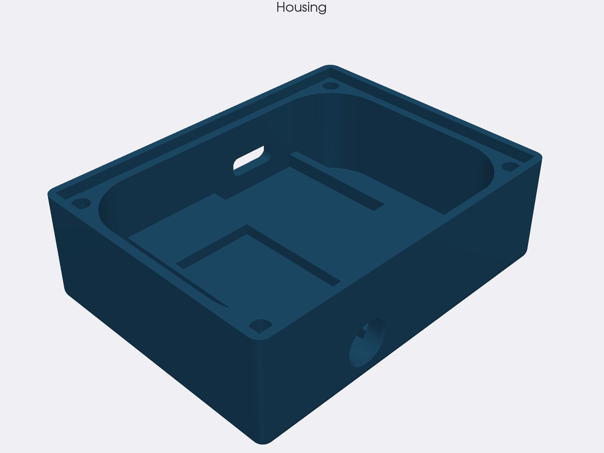
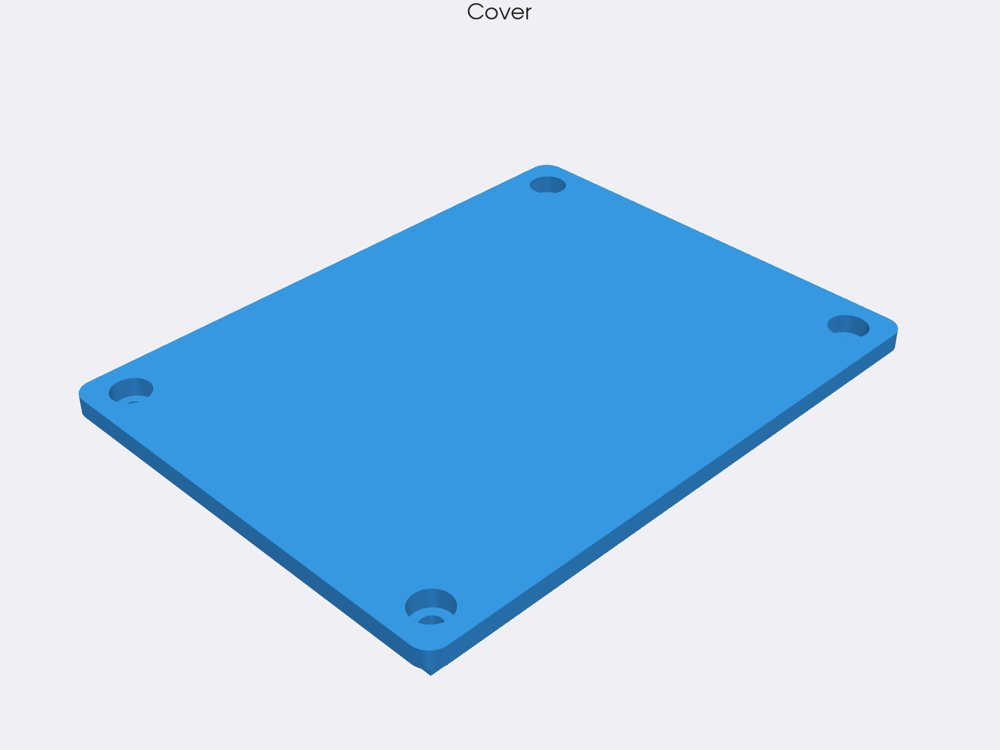
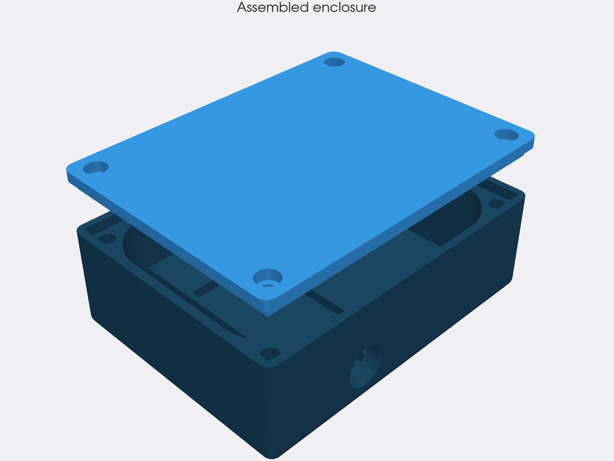
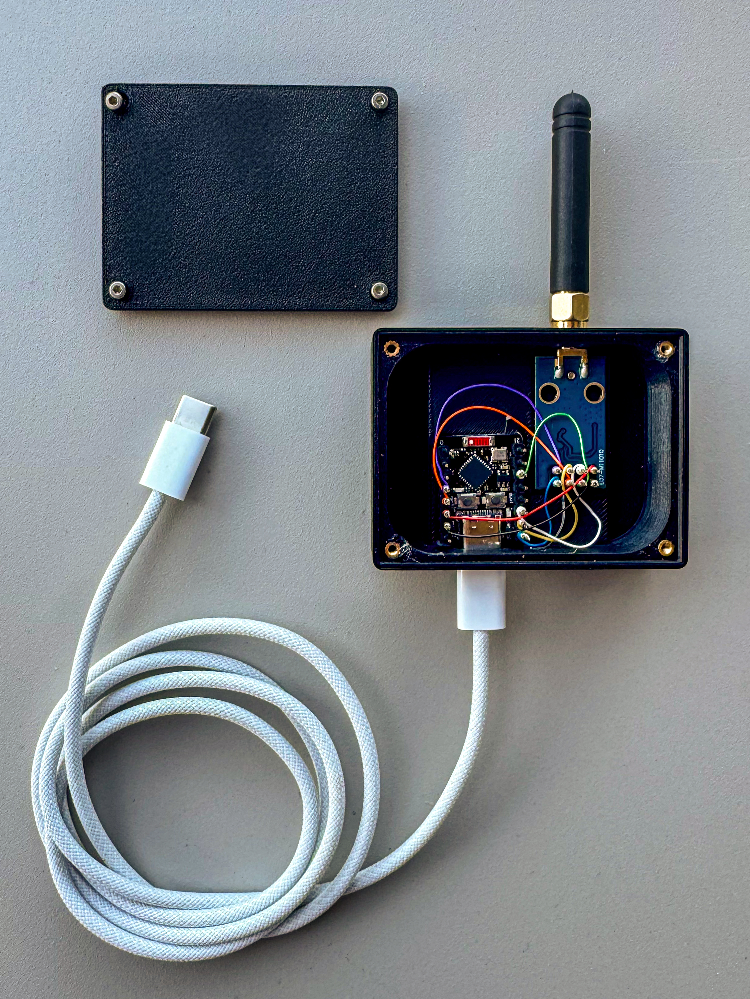

# Enclosure

3D-printable housing for the bridge. Holds the ESP32 + CC1101 module + SMA antenna connector with the USB-C cable threaded out the side.

## Renders

| Housing (open) | Cover | Assembled |
|---|---|---|
|  |  |  |

The 4 countersunk corner holes line up with the heat-set inserts pressed into the housing posts ; the SMA bulkhead notch is on the back wall, the USB-C cutout on the side. Renders are generated headless from the STL files by [`scripts/render_meca.py`](../scripts/render_meca.py) (PyVista / VTK).

## Photo

## Files

| File | Purpose |
|---|---|
| `somfyrts2mqtt_housing.FCStd` | FreeCAD source -- modify here, re-export the STLs |
| `somfyrts2mqtt_housing-box_housing.stl` | Main box, print 1× |
| `somfyrts2mqtt_housing-box_cover.stl` | Lid, print 1× |
| `IMG_2297.jpg` | Photo of the assembled device with the lid removed, USB-C cable and SMA whip antenna attached |

## Interconnect : wire-wrapping recommended

Dupont jumpers work but rattle around in a 3D-printed box and add 1-2 cm of unnecessary loop -- enough to degrade SPI signal integrity on borderline CC1101 clones (see [docs/troubleshooting.md](../docs/troubleshooting.md#cc1101-not-responding)). The cleanest interconnect between the ESP32 and the CC1101 inside this housing is **wire-wrapping** with 30 AWG wire :

- 7 wires (SCK, MISO, MOSI, CSN, GDO0, VCC, GND), straight, short (< 3 cm).
- Wrap the wire around the pin header posts on both boards. No solder needed at first ; once you're sure the wiring works, dab a tiny bit of solder on each wrap for permanence.
- Tighter, lighter, lower-impedance than Dupont. The photo above shows this style.

Wire-wrap tool : a 30 AWG / Vector P184 wrap tool costs ~5 €. The 30 AWG enameled / silver-plated wire comes on a spool for a couple of euros.

## Mechanical bill of materials

In addition to the [electronic BoM](../docs/hardware.md#bill-of-materials) you need :

| Part | Qty | Notes |
|---|---|---|
| **M2 heat-set brass insert** | 4 | Pressed into the 4 corner posts of the housing with a soldering iron at ~200 °C. The cover then bolts onto these inserts |
| **M2 screw, ~6 mm long** | 4 | Holds the cover onto the housing. Cap-head looks cleaner ; flat-head is fine |
| **SMA-to-PCB pigtail or SMA bulkhead** | 1 | Soldered to the CC1101 `ANT` pad (the housing has a notch for the SMA flange) |
| **433 MHz whip antenna with SMA male** | 1 | Or a 17.3 cm wire if you prefer the bare-wire route -- but the SMA + antenna combo looks far cleaner |

## Print settings

Tested with PLA on a Bambu Lab printer ; defaults are forgiving :

| Setting | Value |
|---|---|
| Material | PLA or PETG (PETG if the bridge sits in direct sunlight / heat) |
| Layer height | 0.2 mm |
| Infill | 20 % gyroid or grid |
| Perimeters | 3 |
| Top / bottom layers | 4 |
| Supports | None required (the design is print-orientation-friendly) |
| Brim | 5 mm for the housing if you have warping issues ; not needed for the lid |
| Print orientation | Housing : opening up. Lid : flat |

## Modifying the design

Open `somfyrts2mqtt_housing.FCStd` in [FreeCAD](https://www.freecad.org/) ≥ 0.21. The model is parametric -- key dimensions live in a spreadsheet at the top of the tree. After editing, re-export both STLs from the `Mesh` workbench.
